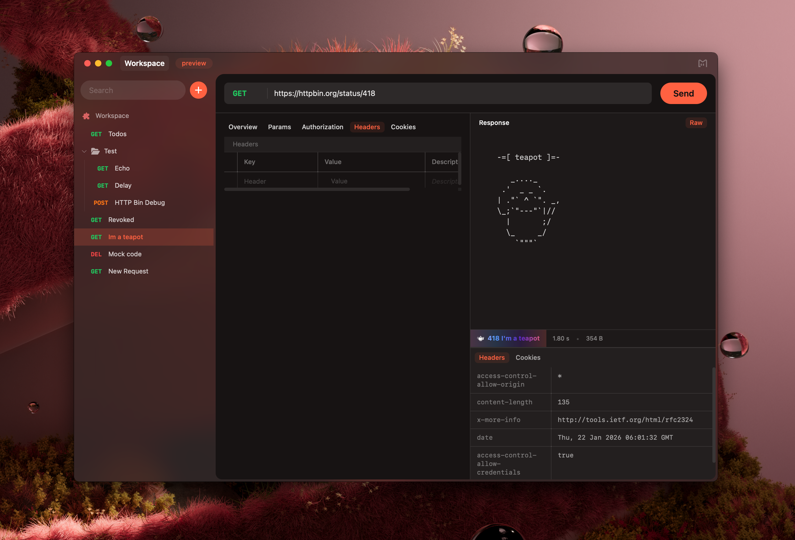
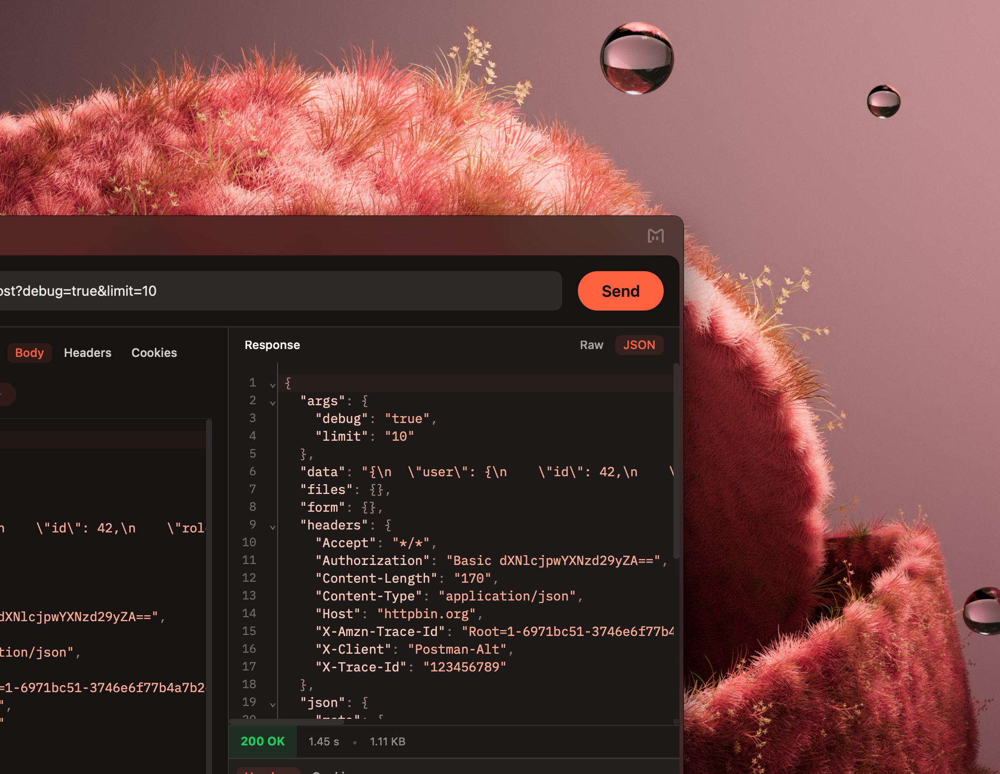
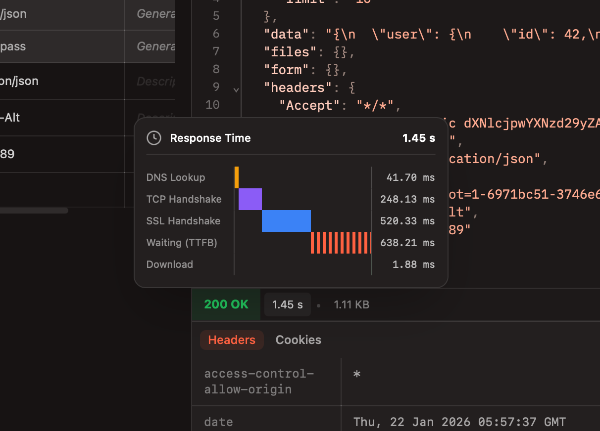

Mandy provides a cleaner way to test APIs.


With Mandy you can:
- Generate API documentation automatically as you test
- Share requests with teammates via deep links
- Use variable-powered environments for dynamic testing
- Import from any format in a single click
- Auto-create variables from secrets that you paste.




## Features

### Project Management
- Organize API requests into collections and folders
- Multi-environment support with variable substitution
- Import from Postman, Insomnia, and OpenAPI formats
- Export collections for sharing

### Request Building
- Full HTTP method support (GET, POST, PUT, PATCH, DELETE, HEAD, OPTIONS)
- Multiple body types: JSON, form data, raw text, and file uploads
- Authentication: Basic, Bearer auth
- Request headers and query parameters management
- cURL command import

### Response Handling
- Syntax-highlighted response viewing
- JSON auto-formatting and exploration
- Accurate in-depth response timing analysis
- Cookie management

## Screenshots




## Getting Started

```bash
# Install dependencies
bun install

# Run development server
bun run dev

# Build for production
bun run build

# Run Tauri desktop app
bun run tauri dev
```

## Importing Collections

Mandy supports importing from popular API tools:

- Postman Collection (v2.1)
- Insomnia Collection
- OpenAPI/Swagger specifications
- cURL commands
- Mandy Project 

## Roadmap

- [x] REST API Testing
- [ ] GraphQL Support
- [ ] WebSockets
- [ ] Workflows
- [ ] SocketIO
